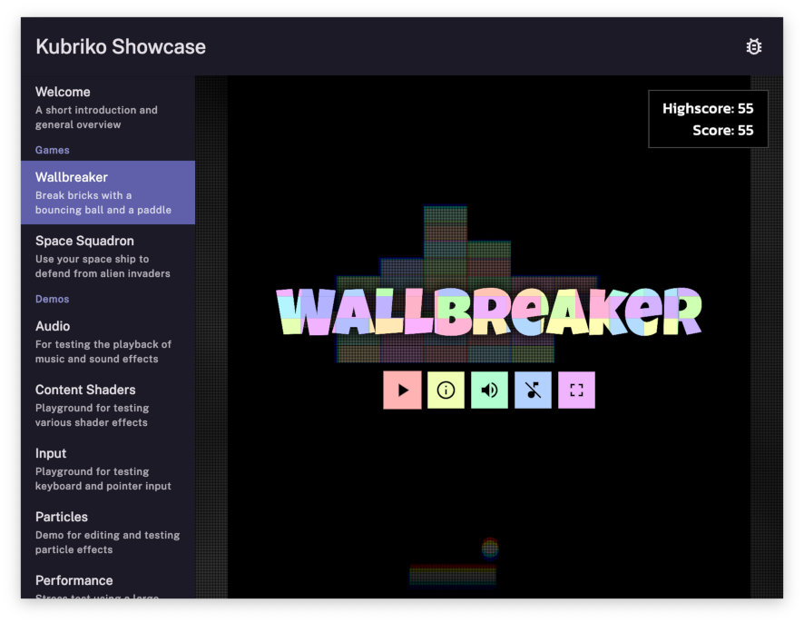
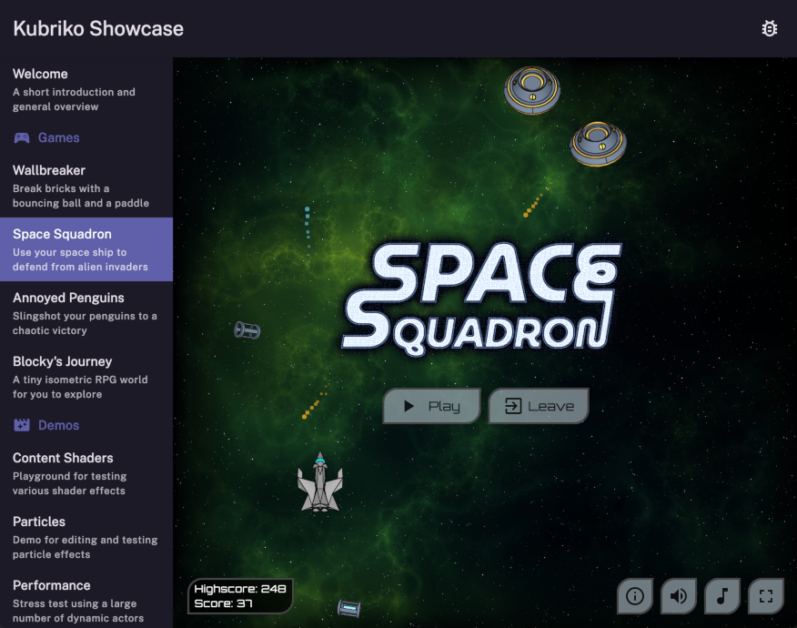
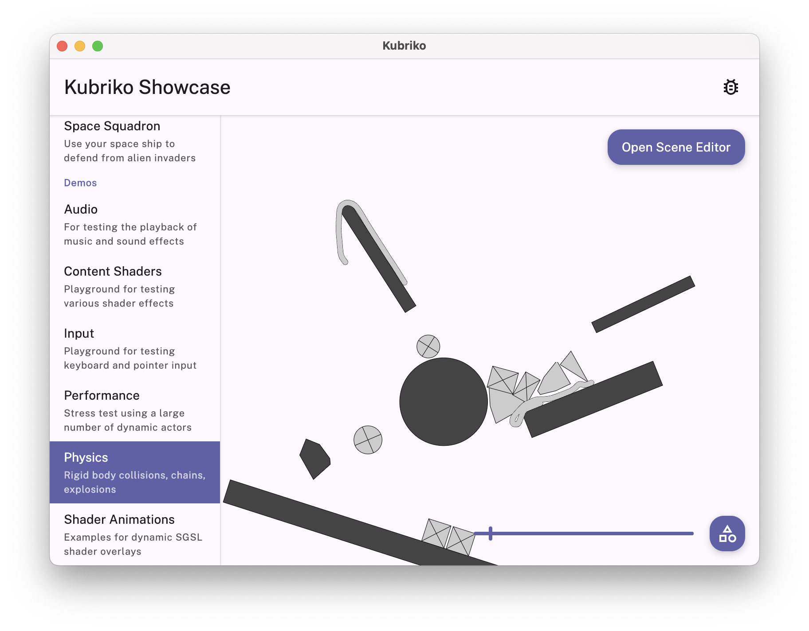
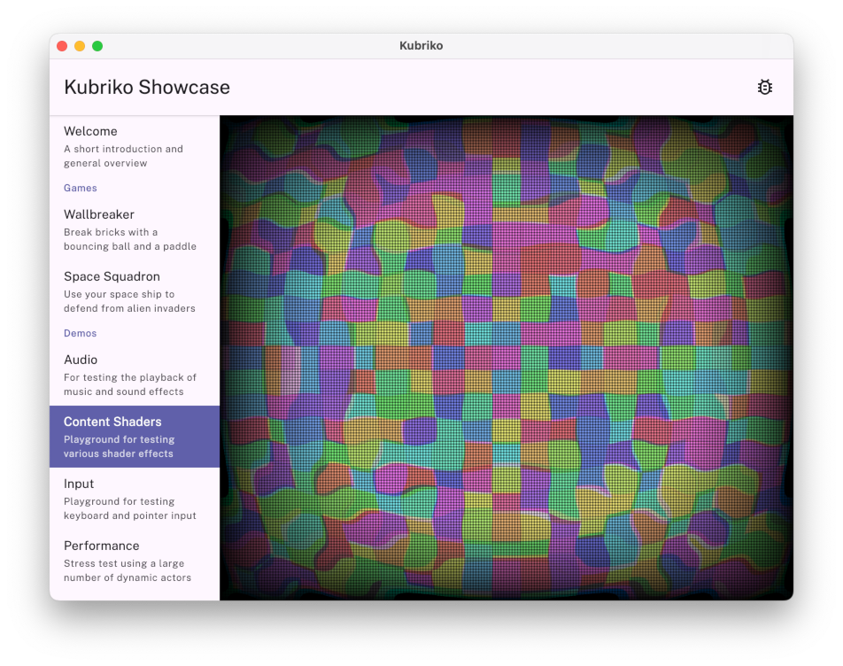
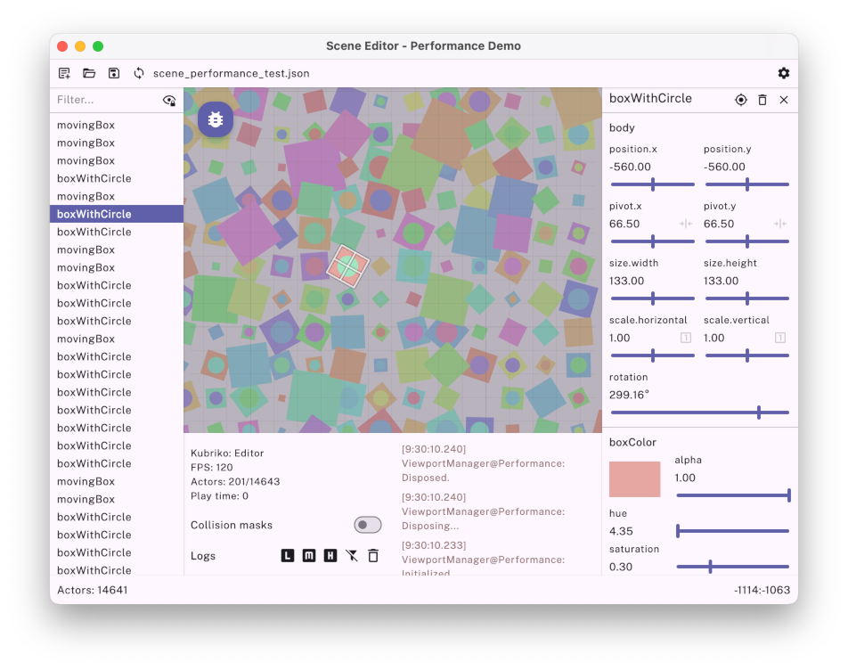
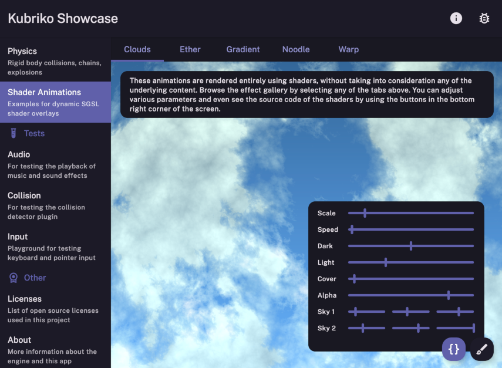

# Kubriko
*A 2D game engine based on Compose Multiplatform*

This repository contains the source code of the Kotlin Multiplatform library and its plugins / tooling, as well as the Kubriko Showcase application that demonstrates the engine's capabilities.

> [!IMPORTANT]  
> Kubriko is in early stages of development. The API might change and bugs can be present.

## 🎮 Overview
Kubriko aims to offer a lightweight, scalable, and easy-to-use solution for creating simple 2D games for **Android**, **Desktop** (Windows, Linux, macOS), **iOS** and **Web**.
It achieves this goal by exposing a [Composable](https://www.jetbrains.com/compose-multiplatform/) function that can easily be embedded into [Kotlin Multiplatform](https://kotlinlang.org/docs/multiplatform.html) projects.

The engine is highly modular, because its core functionality can be extended in a granular fashion using different plugins.
These plugins cover most needs of simple games; from viewport scaling and object management, through persistence, input handling, and audio playback, all the way to shaders and physics simulation.
Kubriko also offers a number of tools, such as a Scene Editor and a Debug Menu, that can be useful during development.

The tech stack is easy to extend by creating custom plugins, and the low-level integration makes it possible to communicate with platform API-s in a straightforward way.

> [!NOTE]
> The Kotlin/Wasm export functionality of Compose Multiplatform is currently in alpha. This also applies to the Web version of games created with Kubriko.

## 🎨 Showcase app
Clone this repository and run the `app` module for the supported targets (Android, Desktop, iOS, Web) to check out what the engine is capable of.

You can find the pre-built applications following these links:

> [!NOTE]
> Some of the links above might not be available / up to date, so the best way to try Kubriko Showcase is to build the project yourself.

## 📚 Learning
Follow the links below to get started with the first steps of integrating the library, to read the full documentation, to watch step by step videos on how to approach
specific types problems, or to join our Discord server where you can discuss more advanced topics with the community, or promote your own creations.

Another way to learn about Kubriko is to explore this repository and understand how the various examples are implemented.

And the best way, of course, is having fun while creating your very own games!

## 🏗️ Project structure
Besides hosting the engine's source code, this repository also serves as the documentation for its feature set. Each top-level folder / module has its own Readme file that contains general information about the relevant piece of functionality:
- [app](https://github.com/pandulapeter/kubriko/tree/main/app) - The menu system for the showcase app. It ties together the modules located in the `examples` folder.
- [documentation](https://github.com/pandulapeter/kubriko/tree/main/documentation) - Contains markdown files with an overview of the Kubriko API.
- [engine](https://github.com/pandulapeter/kubriko/tree/main/engine) - Defines the core components of Kubriko.
- [examples](https://github.com/pandulapeter/kubriko/tree/main/examples) - Contains the implementation of the games and demos of the showcase app.
- [plugins](https://github.com/pandulapeter/kubriko/tree/main/plugins) - These modules can be used to extend the functionality of Kubriko.
- [tools](https://github.com/pandulapeter/kubriko/tree/main/tools) - Extensions that can be useful during development such as the Scene Editor. 

For more details, read the KDoc comments for the classes and functions that are exposed in the public API.

## 📜 Artifacts

Expand the sections below to see the complete list of all Kubriko dependencies hosted on [MavenCentral](https://repo1.maven.org/maven2/io/github/pandulapeter/kubriko/).

Engine

- `io.github.pandulapeter.kubriko:engine`

Plugins

- `io.github.pandulapeter.kubriko:plugin-audio-playback`
- `io.github.pandulapeter.kubriko:plugin-collision`
- `io.github.pandulapeter.kubriko:plugin-keyboard-input`
- `io.github.pandulapeter.kubriko:plugin-particles`
- `io.github.pandulapeter.kubriko:plugin-persistence`
- `io.github.pandulapeter.kubriko:plugin-physics`
- `io.github.pandulapeter.kubriko:plugin-pointer-input`
- `io.github.pandulapeter.kubriko:plugin-serialization`
- `io.github.pandulapeter.kubriko:plugin-shaders`
- `io.github.pandulapeter.kubriko:plugin-sprites`

Tools

- `io.github.pandulapeter.kubriko:tool-debug-menu`
- `io.github.pandulapeter.kubriko:tool-logger`
- `io.github.pandulapeter.kubriko:tool-scene-editor`
- `io.github.pandulapeter.kubriko:tool-ui-components`

The latest version is:

## 🫶️ Support
Displaying the [Kubriko logo](https://pandulapeter.github.io/kubriko/documentation/images/logo.png) in games created with the engine, or just mentioning Kubriko somewhere in the credits is highly appreciated!
Also, if you create anything with Kubriko that you're proud of, don't hesitate to reach out to me via [email](mailto:pandulapeter@gmail.com) or [Discord](https://discord.gg/9CqVUGpK)!

Kubriko is my pet project, that I'm developing in my free time. If you found it useful, I'm happy to accept donations through the following means:

Thank you in advance!

## 🤝 Contributing
Any help in making Kubriko a better engine is very welcome!
- For improvement ideas or bug reports simply create a [new issue](https://github.com/pandulapeter/kubriko/issues/new). Make sure to provide as many details as possible and use the correct labels.
- For code contributions use the [project board](https://github.com/users/pandulapeter/projects/11) to make sure that the issue you want to fix is not already being worked on. Please leave a comment as well so that the issue can be assigned to you! After that fork the project, commit your changes, push them to the repository, and create a [pull request](https://github.com/pandulapeter/kubriko/compare).

## ⚖️ License
This library is published under the Mozilla Public License Version 2.0, which can be found [here](https://github.com/pandulapeter/kubriko/blob/main/LICENSE).
You are free to use the Kubriko engine to develop your own proprietary games at no cost and without attribution.

However, if you create derivative works (such as forks or competing engines), these must be open source and include a link back to this repository.