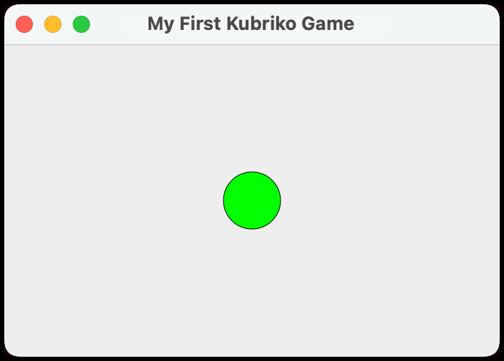

# Getting started

This page guides you through creating an empty project that contains the basic setup for any Kubriko game.

## 1 - Creating a Compose Multiplatform project

The first step is using the [Kotlin Multiplatform Wizard](https://kmp.jetbrains.com/) to generate the project files.


Enter a **Project Name** and a **Project ID**, and select all the platforms that you want your game to support. Please note that:

- iOS builds can only be created on a macOS device.
- If you need iOS support, make sure you have selected the radio button for "Share UI (with Compose Multiplatform UI framework)".
- The "Server" target is irrelevant for Kubriko.

After all the options are properly configured, press the **Download** button.
Extract the .zip file you just downloaded and open it in your IDE of choice ([Android Studio](https://developer.android.com/studio)
or [IntelliJ IDEA](https://www.jetbrains.com/idea/download/) are recommended).

Check out the [official guide](https://www.jetbrains.com/help/kotlin-multiplatform-dev/multiplatform-create-first-app.html#create-the-project-with-a-wizard) to
better understand the files of the project.

- To test the Android app, follow the instructions
  from [here](https://www.jetbrains.com/help/kotlin-multiplatform-dev/multiplatform-create-first-app.html#run-your-application-on-android).
- To test the iOS app, follow the instructions
  from [here](https://www.jetbrains.com/help/kotlin-multiplatform-dev/multiplatform-create-first-app.html#run-your-application-on-ios) (again, you need a
  computer running macOS to do this).
- To test the Desktop (jvm) app, use the `./gradlew run` command.
- To test the Web (wasmJs) app, use the `./gradlew wasmJsBrowserRun` command.

It might be a good idea to create separate [Run Configurations](https://www.jetbrains.com/guide/java/tutorials/hello-world/creating-a-run-configuration/) for
each platform to simplify switching between the different targets in the future:


Make sure you have tested the build process for all of the platforms that you want to support before moving on to the next step.

## 2 - Adding the Kubriko engine dependency

Open the `libs.versions.toml` file from your project's `gradle` folder.
This file is the version catalog for all the third party dependencies of your project.

It already contains a number of dependencies (some of which are unused and can safely be deleted). We need to add Kubriko to the list.
To do that, first define the version reference by adding a new line to the `[versions]` section:

```toml
kubriko = "0.0.1"
```

Use the latest release version of Kubriko that can be found [here](https://github.com/pandulapeter/kubriko/releases).
Regularly update this version number to get access to the latest features and bug fixes.

While we're here, we should make sure that the following three versions in your project's `libs.versions.toml` are at least equal to the versions defined for
Kubriko.
Cross reference these dependency versions with their counterparts from [here](https://github.com/pandulapeter/kubriko/blob/main/gradle/libs.versions.toml) and
update where necessary.

- `android-compileSdk` (only if your project supports Android)
- `android-minSdk` (only if your project supports Android)
- `compose-multiplatform`

> [!IMPORTANT]  
> Trying to use versions incompatible with Kubriko might prevent certain targets from compiling.

Next, define the library reference by adding a new line to the `[libraries]` section:

```toml
kubriko-engine = { group = "io.github.pandulapeter.kubriko", name = "engine", version.ref = "kubriko" }
```

After this we need to reference the library in the game module's `build.gradle.kts` file (by default the module is named `composeApp`):

```kotlin
kotlin {
    //...
    sourceSets {
        //...
        commonMain.dependencies {
            //...
            implementation(libs.kubriko.engine)
        }
    }
}
```

Make sure to sync the project after changing the build script.

## 3 - Integrating KubrikoViewport

Following the previous step you should be able to access the classes and functions provided by Kubriko (the engine itself only, as we didn't yet add any plugin
dependencies).
Furthermore, you should also be able to see the sources, and more importantly, the KDoc comments of Kubriko's public API.

Let's verify this by replacing the app's main Composable (by default located in the `commonMain` source set's `App.kt` file)
with [KubrikoViewport](https://github.com/pandulapeter/kubriko/blob/main/engine/src/commonMain/kotlin/com/pandulapeter/kubriko/KubrikoViewport.kt).
While `KubrikoViewport` is responsible for the game's UI, we also need to provide
a [Kubriko](https://github.com/pandulapeter/kubriko/blob/main/engine/src/commonMain/kotlin/com/pandulapeter/kubriko/Kubriko.kt) instance to it that handles the
game state.
Here's how the `App()` Composable function should look like after all the changes:

```kotlin
import androidx.compose.runtime.Composable
import androidx.compose.runtime.remember
import com.pandulapeter.kubriko.Kubriko
import com.pandulapeter.kubriko.KubrikoViewport
import org.jetbrains.compose.ui.tooling.preview.Preview

@Composable
@Preview
fun App() {
    val kubriko = remember { Kubriko.newInstance() }
    KubrikoViewport(
        kubriko = kubriko,
    )
}
```

Verify that you're able to see the sources for these newly added components.
More importantly, try running the app to make sure that there are no compilation issues.

If everything went well, you should see an empty screen, as we didn't add anything to the game yet.

## 4 - Creating an Actor

Implementations of the [Actor](https://github.com/pandulapeter/kubriko/blob/main/engine/src/commonMain/kotlin/com/pandulapeter/kubriko/actor/Actor.kt) interface
are responsible for playing well-defined roles in your game. For example, in a platformer, the main character (that's controlled by the player) should be an
Actor. But so should every enemy NPC, every platform that the character can jump on, and even the small graphical details such as the trees and clouds in the
background.

Actors are meant to implement one or more interfaces, called Traits, that define what they are capable of (every Trait extends the `Actor` interface). For the
purposes of this demo, we will use
the [Visible](https://github.com/pandulapeter/kubriko/blob/main/engine/src/commonMain/kotlin/com/pandulapeter/kubriko/actor/traits/Visible.kt) Trait which will
allow our Actor to draw onto the scene. Visible Actors need to have bodies that define their position and size of the area they can draw to (and can also be
used to transform the Actor's drawing canvas by rotation or scaling).

Let's create a brand new class for our first Actor, which will be a green ball.

```kotlin
import androidx.compose.ui.graphics.Color
import androidx.compose.ui.graphics.drawscope.DrawScope
import androidx.compose.ui.graphics.drawscope.Stroke
import com.pandulapeter.kubriko.actor.body.CircleBody
import com.pandulapeter.kubriko.actor.traits.Visible
import com.pandulapeter.kubriko.extensions.sceneUnit

class Ball : Visible {
    override val body = CircleBody(
        initialRadius = 40.sceneUnit,
    )

    override fun DrawScope.draw() {
        drawCircle(
            color = Color.Green,
            radius = body.radius.raw,
            center = body.size.center.raw,
        )
        drawCircle(
            color = Color.Black,
            radius = body.radius.raw,
            center = body.size.center.raw,
            style = Stroke(),
        )
    }
}
```

Note that the coordinate system within the game world is measured in SceneUnits. This is important because for more complex games we don't want to confuse world
coordinates with scene coordinates.
While this is not relevant for our current example (as this game's viewport won't support zooming in or out), the API still enforces the distinction.

As we didn't specify an `initialPosition` for our `CircleBody`, it will get spawned at the origin of the coordinate system.

> [!IMPORTANT]  
> The origin point of Kubriko's coordinate system is the center of the Composable, NOT any of its corners. This way it's easier to keep the important part of
> the window in focus if it gets resized.

The `draw()` function simply draws a green circle with a black outline. The coordinates here are relative to the `body`, so whenever we want to move our ball,
we just have to update its body's position (no need to change anything in the `draw()` function).

## 5 - Working with Managers

Subclasses of [Manager](https://github.com/pandulapeter/kubriko/blob/main/engine/src/commonMain/kotlin/com/pandulapeter/kubriko/manager/Manager.kt) are
responsible for dealing with the high-level aspects of games such as loading stuff, playing music, keeping score, or manipulating the lower-level Actors.
Managers are there for the entire lifecycle of the `Kubriko` instance, while Actors can be added or removed any time (by
using [ActorManager](https://github.com/pandulapeter/kubriko/blob/main/engine/src/commonMain/kotlin/com/pandulapeter/kubriko/manager/ActorManager.kt)). Managers
can also communicate directly with each other by having references to other `Manager` instances.

Our really simple game already has four built-in Managers out of the box (more on that later), but to start introducing custom functionality for our gameplay,
we might want to create and add a fifth one.

Let's create a new class called `GameplayManager` that's responsible for adding the `Ball` to the scene:

```kotlin
import com.pandulapeter.kubriko.Kubriko
import com.pandulapeter.kubriko.manager.ActorManager
import com.pandulapeter.kubriko.manager.Manager

class GameplayManager : Manager() {

    private val actorManager by manager<ActorManager>()

    override fun onInitialize(kubriko: Kubriko) {
        actorManager.add(Ball())
    }
}
```

Our new manager references the built-in `ActorManager`, and notifies it to add a new `Ball` instance when the game starts (the `onInitialize()` function only
gets called once, right before `KubrikoViewport` becomes visible for the first time).

> [!WARNING]  
> Do not try to use `Manager` references before `onInitialize()` is called.

While our `Manager` is now ready, it needs to be registered with the `Kubriko` instance before it can start doing its job. To do this, let's update just one
line in the implementation we have for the `App` Composable:

```kotlin
val kubriko = remember { Kubriko.newInstance(GameplayManager()) }
```

Any number of Managers can be registered simply by enlisting them in the `Kubriko.newInstance()` function.

You can run the game to see how the green ball is now displayed in the middle of the window!



## 6 - Setting things in motion

As admiring a static circle might get a bit boring after a while, it's time to make our game more exciting by making the ball move!

As mentioned before, Actors new learn skills by implementing more Trait interfaces. To be able to update its body's state in every frame, the `Ball` Actor
should become [Dynamic](https://github.com/pandulapeter/kubriko/blob/main/engine/src/commonMain/kotlin/com/pandulapeter/kubriko/actor/traits/Dynamic.kt) (
besides already
being [Visible](https://github.com/pandulapeter/kubriko/blob/main/engine/src/commonMain/kotlin/com/pandulapeter/kubriko/actor/traits/Visible.kt)).

```kotlin
import androidx.compose.ui.graphics.Color
import androidx.compose.ui.graphics.drawscope.DrawScope
import androidx.compose.ui.graphics.drawscope.Stroke
import com.pandulapeter.kubriko.actor.body.CircleBody
import com.pandulapeter.kubriko.actor.traits.Dynamic
import com.pandulapeter.kubriko.actor.traits.Visible
import com.pandulapeter.kubriko.extensions.sceneUnit
import com.pandulapeter.kubriko.types.SceneOffset

class Ball : Visible, Dynamic {
    override val body = CircleBody(
        initialRadius = 40.sceneUnit,
    )

    private var horizontalSpeed = 0.5f.sceneUnit
    private var verticalSpeed = 0.5f.sceneUnit

    override fun update(deltaTimeInMilliseconds: Int) {
        body.position += SceneOffset(
            x = horizontalSpeed,
            y = verticalSpeed,
        ) * deltaTimeInMilliseconds
    }

    override fun DrawScope.draw() {
        drawCircle(
            color = Color.Green,
            radius = body.radius.raw,
            center = body.size.center.raw,
        )
        drawCircle(
            color = Color.Black,
            radius = body.radius.raw,
            center = body.size.center.raw,
            style = Stroke(),
        )
    }
}
```

Just a couple of additions here: we've implemented the `Dynamic` interface that brought in the `update()` function. Here we move the ball by incrementing its
offset with a value composed by the newly added `horizontalSpeed` and `verticalSpeed` components, multiplied with `deltaTimeInMilliseconds`.

> [!NOTE]
> The `update()` function is invoked by Kubriko's `ActorManager` in every frame, as long as the game is focused. The `deltaTimeInMilliseconds` parameter
> provides
> the number of milliseconds that have passed since drawing the previous frame. It is important to multiply any motion's parameters with this value so that we
> can
> compensate for changes in the frame rate. Some devices might run our game at 120 FPS, while others only at 90 or 60. Performance-heavy processing can
> introduce
> fluctuations in the frame rate even on the same device. Using delta time keeps the gameplay balanced by compensating for these fluctuations.
>
> The value of `deltaTimeInMilliseconds` will be 0 if the game is focused, but not running. This is intended to be used for pausing the game. Check out the
> built-in
> [StateManager](https://github.com/pandulapeter/kubriko/blob/main/engine/src/commonMain/kotlin/com/pandulapeter/kubriko/manager/StateManager.kt) to work with
> the `focused` and `running` states.

If you run the game now, you should see that the ball moves diagonally out of the viewport.

> [!NOTE]
> Kubriko's coordinate system directions are consistent with Compose: the X axis is incremented from left to right while the Y axis from top to bottom.

Again, once the ball leaves the screen things do get a bit boring, so let's prevent that from happening!

To be able to constrain it within the viewport, we should
get access to the viewport dimensions. There's another built-in manager that's responsible for
this: [ViewportManager](https://github.com/pandulapeter/kubriko/blob/main/engine/src/commonMain/kotlin/com/pandulapeter/kubriko/manager/ViewportManager.kt). You
should already be able to inject
the `ViewportManager` instance into `Ball` by saving its reference via the `manager<ViewportManager>()` delegate in `GameplayManager` and passing it through the
constructor of `Ball` in the `onInitialize()` function, but let's look at a different approach now:

```kotlin
import com.pandulapeter.kubriko.Kubriko
import com.pandulapeter.kubriko.actor.traits.Dynamic
import com.pandulapeter.kubriko.actor.traits.Visible
import com.pandulapeter.kubriko.extensions.get
import com.pandulapeter.kubriko.manager.ViewportManager

// ...

class Ball : Visible, Dynamic {

    private lateinit var viewportManager: ViewportManager

    override fun onAdded(kubriko: Kubriko) {
        viewportManager = kubriko.get()
    }

    // ...
}
```

The `onAdded()` function is part of the
base [Actor](https://github.com/pandulapeter/kubriko/blob/main/engine/src/commonMain/kotlin/com/pandulapeter/kubriko/actor/Actor.kt) interface and is invoked by
`ActorManager` the moment the `Actor` is added to the Scene. As we receive
the `Kubriko` instance as an argument, we can grab references to any registered `Manager` instances from it using the `get` extension function. Make sure you import the
reified inline function as in the example above.

Now that we can ask the dimensions of the screen from `ViewportManager`, let's modify the `update()` function to make the ball bounce back from the edges of the
viewport:

```kotlin
private var previousPosition = body.position

override fun update(deltaTimeInMilliseconds: Int) {
    val viewportTopLeft = viewportManager.topLeft.value
    val viewportBottomRight = viewportManager.bottomRight.value
    val offset = SceneOffset(
        x = horizontalSpeed,
        y = verticalSpeed,
    )
    val nextPosition = (body.position + offset * deltaTimeInMilliseconds).constrainedWithin(
        topLeft = viewportTopLeft,
        bottomRight = viewportBottomRight,
    )
    var shouldJumpBackToPreviousPosition = false
    if (nextPosition.x == viewportTopLeft.x || nextPosition.x == viewportBottomRight.x) {
        shouldJumpBackToPreviousPosition = true
        horizontalSpeed *= -1
    }
    if (nextPosition.y == viewportTopLeft.y || nextPosition.y == viewportBottomRight.y) {
        shouldJumpBackToPreviousPosition = true
        verticalSpeed *= -1
    }
    if (shouldJumpBackToPreviousPosition) {
        body.position = previousPosition
    }
    previousPosition = body.position
    body.position = nextPosition
}
```

Okay, let's see what's going on here. First we've created an instance variable that holds the position of the Body from the previous frame. This is useful
because whenever the ball is on the edge of the screen, we should move it back to its previous position, to prevent it from getting stuck.

In the `update()` function first we make sure that the next position of the ball is within the viewport bounds by using the `constrainedWithin()` extension
function. But then we test this position against the edges of the screen, and only move the `Body` to it if there was no collision. However, if the ball has
reached one of the edges, we move it back to its previous position as mentioned before, and flip the relevant component of the speed vector so that it will
change its movement direction starting with the next frame.

> [!NOTE]
> While the `ViewportManager` usually deals with screen coordinates, the `topLeft` and `bottomRight` Flows are converted to `SceneOffset` values for convenience.
> They take into consideration pan and zoom and will always point to the corners of the viewport in the world space.

Run the app now to see how the bouncing works! Testing it on desktop or web is especially useful, since you can check how seamlessly the game responds to
changing the window size at runtime.

## 7 - Adding plugins

TODO

## 8 - Menus

TODO (draw on top of the KubrikoCanvas, or use Managers)

## 9 - Next steps

This should cover the basics of what you need to get started developing your first Kubriko game!
Feel free to play around with the various components, and have fun exploring the possibilities.
Don't forget to read the KDoc comments of the public API components to get more information about how they are intended to be used.
If you ever get stuck, check out the resources below:

[](https://github.com/pandulapeter/kubriko/blob/main/documentation/README.md)
[](https://github.com/pandulapeter/kubriko/blob/main/documentation/TUTORIAL_VIDEOS.md)
[](https://discord.gg/9CqVUGpK)