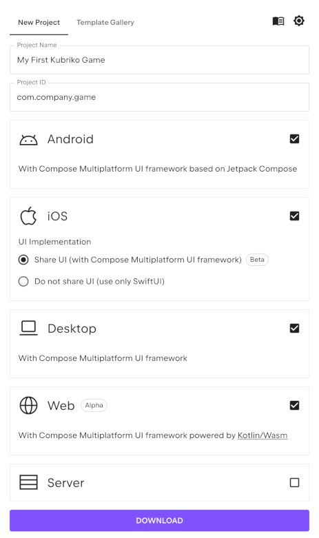
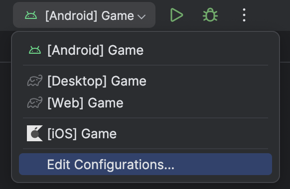

# Getting started

These pages guide you through creating your first Kubriko game from scratch.

## 1 - Creating a Compose Multiplatform project

> [!IMPORTANT]  
> This page of the documentation is already outdated. The latest version of the Compose Multiplatform plugin includes a built-in
> wizard that can be used to create new projects right from the IDE. Feel free to use that solution instead, and proceed to the
> [next page](https://github.com/pandulapeter/kubriko/blob/main/documentation/GETTING_STARTED_02.md).

The first step is using the [Kotlin Multiplatform Wizard](https://kmp.jetbrains.com/) to generate the project files.

Enter a **Project Name** and a **Project ID**, and select all the platforms that you want your game to support. Please note that:

- iOS builds can only be created on a macOS device.
- If you need iOS support, make sure you have selected the radio button for "Share UI (with Compose Multiplatform UI framework)".
- The "Server" target is irrelevant for Kubriko.

After all the options are properly configured, press the **Download** button.
Extract the .zip file you just downloaded and open it in your IDE of choice ([Android Studio](https://developer.android.com/studio)
or [IntelliJ IDEA](https://www.jetbrains.com/idea/download/) are recommended).

Check out the [official guide](https://www.jetbrains.com/help/kotlin-multiplatform-dev/multiplatform-create-first-app.html#create-the-project-with-a-wizard) to
better understand the files of the project.

- To test the Android app, follow the instructions
  from [here](https://www.jetbrains.com/help/kotlin-multiplatform-dev/multiplatform-create-first-app.html#run-your-application-on-android).
- To test the iOS app, follow the instructions
  from [here](https://www.jetbrains.com/help/kotlin-multiplatform-dev/multiplatform-create-first-app.html#run-your-application-on-ios) (again, you need a
  computer running macOS to do this).
- To test the Desktop (jvm) app, use the `./gradlew run` command.
- To test the Web (wasmJs) app, use the `./gradlew wasmJsBrowserDevelopmentRun` command.

It might be a good idea to create separate [Run Configurations](https://www.jetbrains.com/guide/java/tutorials/hello-world/creating-a-run-configuration/) for
each platform to simplify switching between the different targets in the future:

Make sure you have tested the build process for all of the platforms that you want to support before moving on to the next step.

