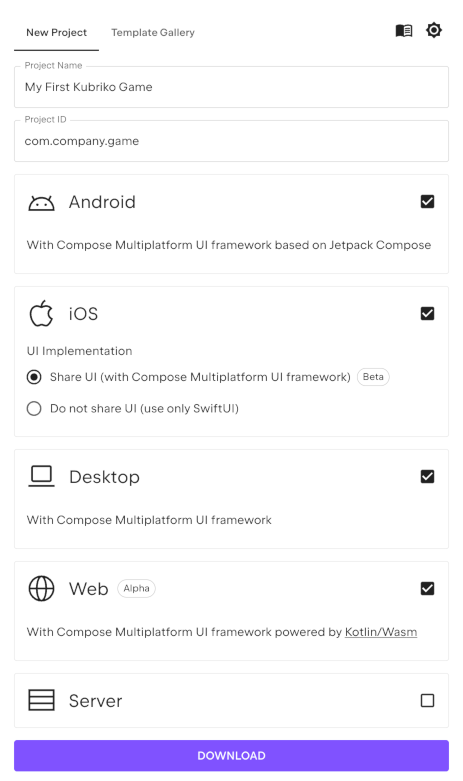
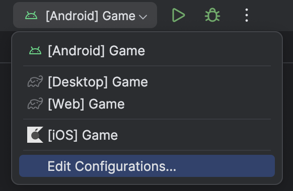

# Getting started

These pages guide you through building your first Kubriko game, one small step at a time.

## What we are going to build

Over the next few pages we'll build a small game together: a ball bouncing around the screen, and a paddle at the bottom that the player moves to keep it
in the air. Nothing fancy, but it touches almost everything you need for a real project: drawing, movement, input, collisions, game state, UI, and sound.

No prior game development experience is assumed. You will need to be reasonably comfortable with [Kotlin](https://kotlinlang.org/) and
[Compose](https://www.jetbrains.com/compose-multiplatform/), since Kubriko builds directly on top of both. If
[Kotlin Multiplatform](https://kotlinlang.org/docs/multiplatform.html) itself is new to you, skim the official introduction first; the tutorial only relies on
the basics.

Each page ends with something you can run, so you can stop at any point and still have a working app.

### The road ahead

| Page | What we add to the game | What you learn about Kubriko |
|---|---|---|
| 1 | An empty Compose Multiplatform project | Project setup |
| 2 | The Kubriko dependency | The version catalog, Java 21, how artifacts are named |
| 3 | An empty game world | The `Kubriko` instance and the `KubrikoViewport` |
| 4 | A ball | Actors, the `Visible` Trait, bodies, scene units |
| 5 | Logic that puts the ball on screen | Managers and the `ActorManager` |
| 6 | Movement, bouncing off the walls | The `Dynamic` Trait, delta time, the `ViewportManager` |
| 7 | A paddle the player controls | Plugins, keyboard and pointer input |
| 8 | The ball bouncing off the paddle | The collision plugin |
| 9 | Score, game over, and a restart button | The `StateManager`, Compose UI inside the viewport |
| 10 | Sound effects and music | The audio playback plugin |
| 11 | Where to go next | The rest of the ecosystem, and the complete code |

> [!TIP]
> Already comfortable with game engines, and would rather see the big picture first? The
> [documentation overview](https://github.com/pandulapeter/kubriko/blob/main/documentation/README.md) describes the engine's building blocks in a few
> paragraphs, and the [engine Readme](https://github.com/pandulapeter/kubriko/tree/main/engine) covers the core concepts. Come back here when you want to see
> them in action.

## 1 - Creating a Compose Multiplatform project

Kubriko is a library, not a standalone editor. That means your game is a regular
[Compose Multiplatform](https://www.jetbrains.com/compose-multiplatform/) app, and the first step is creating one.

The quickest way is the **Kotlin Multiplatform wizard**. You have two options:

- Use the wizard built into the IDE: in [Android Studio](https://developer.android.com/studio) or [IntelliJ IDEA](https://www.jetbrains.com/idea/download/),
  choose *File -> New -> Project -> Kotlin Multiplatform*.
- Or use the [web version](https://kmp.jetbrains.com/), download the generated .zip file, extract it, and open the folder in your IDE.

Either way, you will be asked for a project name, a project ID, and the platforms you want to support. A few things worth knowing:

- Pick **Share UI (with Compose Multiplatform UI framework)**, not the "native UI" option. Kubriko draws the game with Compose, so it needs the shared UI setup.
- iOS apps can only be built on a macOS machine. You can still add the iOS target now and build it later.
- The "Server" target is not useful for Kubriko, so you can leave it out.

You will also need **JDK 21** installed, because that is what Kubriko is built with. Recent IDE versions can download it for you.

### What the wizard gives you

The current wizard generates one module per responsibility:

| Module | What lives there |
|---|---|
| `shared` | All the shared code, including the UI. **This is where your entire game will go.** |
| `androidApp` | The Android entry point: a `MainActivity` that calls the shared `App()` Composable. |
| `desktopApp` | The desktop entry point: a `main()` function that opens a window. |
| `webApp` | The web entry point. |
| `iosApp` | The Xcode project for iOS. |

Almost everything in this tutorial happens in `shared/src/commonMain`. The per-platform app modules are thin wrappers that you will barely touch.

> [!NOTE]
> Older wizard versions produced a single `composeApp` module instead. That works too, and everything here applies just the same, only the paths differ.
> If you see `composeApp/src/commonMain`, read that wherever this tutorial says `shared/src/commonMain`.

### Trying the empty project

Before adding anything, it is a good idea to check that the generated project runs on every platform you care about.
The [official guide](https://www.jetbrains.com/help/kotlin-multiplatform-dev/multiplatform-create-first-app.html) explains the project structure and how to
launch it, but here is the short version:

| Platform | How to run it |
|---|---|
| Android | Use the run configuration the wizard created, with an emulator or a connected device. |
| iOS | Open the `iosApp` folder in Xcode, or use the IDE run configuration (macOS only). |
| Desktop | `./gradlew :desktopApp:run` |
| Web | `./gradlew :webApp:wasmJsBrowserDevelopmentRun` |

It might be worth creating a separate [run configuration](https://www.jetbrains.com/guide/java/tutorials/hello-world/creating-a-run-configuration/) for each
platform, so that switching between them later is just one click:

Once you have seen the default "Hello World" screen on the platforms you plan to support, you are ready for the next step.

> [!TIP]
> If something fails to build at this point, it is almost always an environment issue (a missing SDK, a wrong JDK) rather than
> something Kubriko will fix later. It is much easier to sort it out now than after adding more moving parts.

