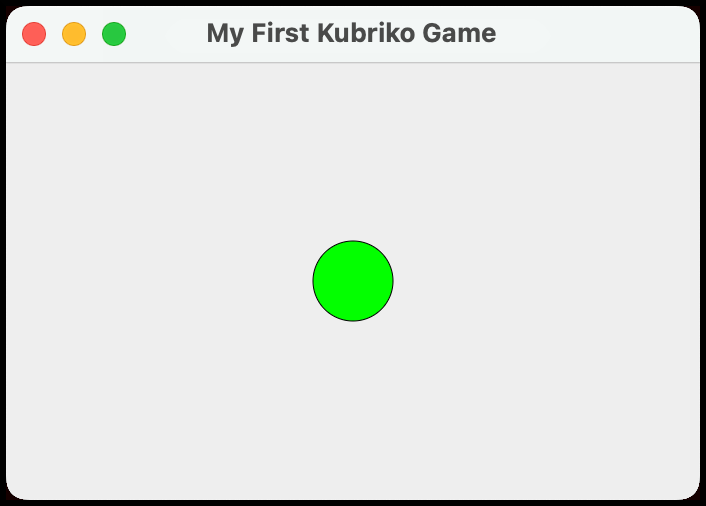

# Getting started

These pages guide you through building your first Kubriko game, one small step at a time.

[](https://github.com/pandulapeter/kubriko/blob/main/documentation/GETTING_STARTED_04.md)
[](https://github.com/pandulapeter/kubriko/blob/main/documentation/GETTING_STARTED_06.md)

## 5 - Working with Managers

If Actors are the objects in your game, **[Managers](https://github.com/pandulapeter/kubriko/blob/main/engine/src/commonMain/kotlin/com/pandulapeter/kubriko/manager/Manager.kt)**
are the systems around them. Keeping score, playing music, deciding when a level ends, spawning enemies: all of that belongs in a Manager.

The difference between the two is mostly about lifetime:

- Actors come and go constantly while the game is running.
- Managers are created together with the `Kubriko` instance and stay until it is disposed. They cannot be added or removed later.

Your game already has four Managers, even though you never asked for them. Kubriko adds them automatically because nothing works without them:

| Manager | Responsibility |
|---|---|
| [ActorManager](https://github.com/pandulapeter/kubriko/blob/main/engine/src/commonMain/kotlin/com/pandulapeter/kubriko/manager/ActorManager.kt) | Keeps track of every Actor in the scene, and lets you add or remove them. |
| [ViewportManager](https://github.com/pandulapeter/kubriko/blob/main/engine/src/commonMain/kotlin/com/pandulapeter/kubriko/manager/ViewportManager.kt) | The camera: position, zoom, and the visible bounds of the world. |
| [StateManager](https://github.com/pandulapeter/kubriko/blob/main/engine/src/commonMain/kotlin/com/pandulapeter/kubriko/manager/StateManager.kt) | Whether the game is running, paused, or unfocused. |
| [MetadataManager](https://github.com/pandulapeter/kubriko/blob/main/engine/src/commonMain/kotlin/com/pandulapeter/kubriko/manager/MetadataManager.kt) | Runtime information such as the current frame rate and the platform the game runs on. |

To add our own gameplay logic, we write a fifth one. Create `GameplayManager.kt`:

```kotlin
import com.pandulapeter.kubriko.Kubriko
import com.pandulapeter.kubriko.manager.ActorManager
import com.pandulapeter.kubriko.manager.Manager

class GameplayManager : Manager() {

    private val actorManager by manager<ActorManager>()

    override fun onInitialize(kubriko: Kubriko) {
        actorManager.add(Ball())
    }
}
```

Two things are happening here.

`manager<ActorManager>()` is a delegate that hands you another Manager. You declare it at the top of the class, and the engine fills it in right before
`onInitialize()` runs. Managers find each other this way, which is how they cooperate without you wiring anything up manually. If the Manager you ask
for was never registered, the delegate throws with a message that says so.

`onInitialize()` runs exactly once. With the default setup it happens when the `KubrikoViewport` is composed for the first time, before the first frame is
drawn. It is the natural place to set up the initial state of your game.

> [!WARNING]
> Don't try to use other Managers before `onInitialize()` has run, for example in a constructor or a property initializer. Until then, the engine hasn't
> finished putting itself together. The `manager<T>()` delegate is safe precisely because it is resolved as part of that process.

The `Manager` base class has two more lifecycle callbacks we won't need in this game: `onUpdate()` runs on every tick of the game loop, and `onDispose()`
runs when the `Kubriko` instance is disposed. The [documentation overview](https://github.com/pandulapeter/kubriko/blob/main/documentation/README.md#-managers)
and the KDoc of `Manager` describe the full contract.

### Registering the Manager

A Manager only does something once the engine knows about it. That means one changed line back in `App.kt`:

```kotlin
private val kubriko = Kubriko.newInstance(GameplayManager())
```

`newInstance()` takes any number of Managers. The four built-in ones are still added automatically, so you only list the ones you added yourself
(plus, later, the ones that come with plugins).

Run the game, and there it is: a green ball, sitting patiently in the middle of the window.



Try resizing the window. The ball stays centered, because it sits at the origin, and the camera keeps the origin in the center of the viewport.

> [!NOTE]
> Managers are initialized in a fixed order: the four built-in ones first, then your own in the order you passed them to `newInstance()`. That only matters
> if one Manager calls into another from `onInitialize()`; the callee has to come earlier in the list. Everything else, like the delegate above, is
> independent of the order.

The [list of Managers](https://github.com/pandulapeter/kubriko/blob/main/documentation/LIST_OF_MANAGERS.md) shows everything the engine and its plugins
provide. You will recognize most of the names by the end of this tutorial.

[](https://github.com/pandulapeter/kubriko/blob/main/documentation/GETTING_STARTED_04.md)
[](https://github.com/pandulapeter/kubriko/blob/main/documentation/GETTING_STARTED_06.md)
